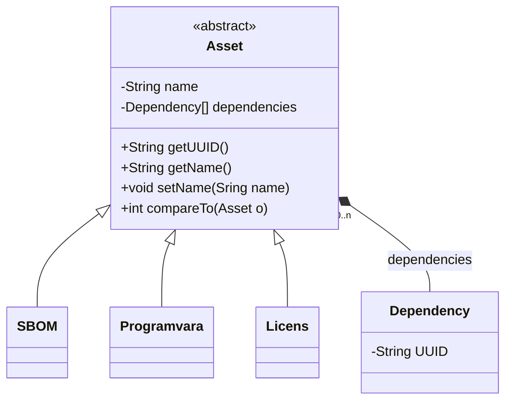
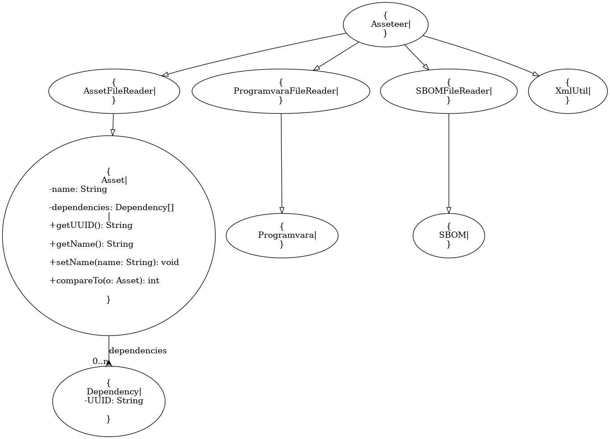

# asseteer
Lightweight Asset Management

Se vidare https://elofturtle.github.io/asseteer-pages/ 

Projektförslag, tänkt att pågå så långt vi hinner, kanske genom forsätningskursen.
# Deltagare
elofturtle
produktpelle
# Roadmap
Det övergripande målet är att skapa en applikation för att hantera diverse tillgångar, som får genomgå flera iterationer/implementationer.
## Vilka assets?
* Globala grupper <--> Teknisk applikation
* CycloneDX & SPDX --> Säkerhetshantering, säka vem som använder vilket beroende
* Tekniska applikationer, till exempel Chrome, vem äger den, var finns systemdokumentation, etc.
## Iterationer (tänkt livscykel för applikationen)
1 Enanvändarsystem utan db
  * Kan läsa & spara data i form av XML, CSV.
  * Sparar sitt globala state som XML
  * Konfiguration
  * menybaserad nmatning via konsol
2 Enanvändarsystem med lokal databas (sqlite e.d. istället för XML för state) 
3 Kunna söka på flera olika sätt, inklusive med wildcard
4 Riktig databas, programmet kan koppla upp sig mot den även om den inte ligger på localhost
5 Söd för REST-gränssnitt, svar/input via JSON primärt
6 Enkelt webbgränsnitt för visning, sökning, inmatning
7 "rikig" deployment på extern server
8 Fleranvändarstöd, sessionshantering, säkra att man inte skriver över varandras redigeringar.
9 Behörighetshantering (admin/write/read)

### Iteration 1 
Kunna konsumera ett antal cyclonedx-xml:er från en mapp (se tex https://github.com/CycloneDX/bom-examples ) genom att ange sökväg på kommandoraden

Komma fram till format för klientapplikationer (vilka uppfiter den delen behöver kunna hantera

Kunna mata in klentapplikationsdata från en csv genom att ange sökväg på kommandoraden

Kunna mata in, söka, lista, redigera, utgå från tidigare information om klientapplikation

Grundläggande konfiguration för applikationen (hårdkodat, tex var leta efter xml:er för cyclonedx) så att man slipper ange det på kommandoraden

# Länkar
## SoftWare IDentification Tag (SWID)
https://scribesecurity.com/blog/spdx-vs-cyclonedx-sbom-formats-compared/
https://pages.nist.gov/swid-tools/
https://github.com/Labs64/swid-generator
https://github.com/swidtags/rpm2swidtag/tree/master
Spara state och hantera ev identisk information som ligger i mapp som läses in (är det sparat state eller indatat som gäller i vilken ordning?)

globala grupper p.s.s. som för klientappliaktioner.

Kunna söka & visualisera beroenden cyclonedx
validera xml https://www.baeldung.com/java-validate-xml-xsd 

# Hur tror Chat GPT att det här projektet ser ut?
## UML-diagram
 
## Interactions
 
## Gick det bra?
Nej, gpt:s forte verkar inte vara den sortens kodanalys.

I eclipse verkar stödet halvt försvunnit, så numera är det kanske främst kommersiella alternativ som gäller. 

Om man nu inte går all in och installerar Papyrus.
